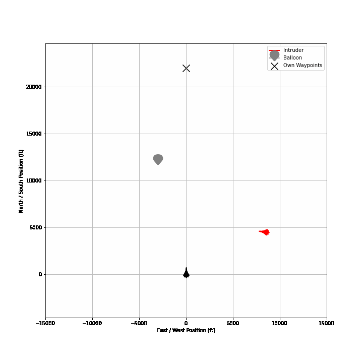
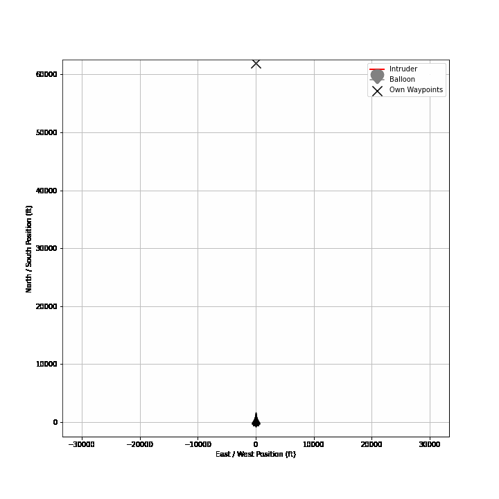
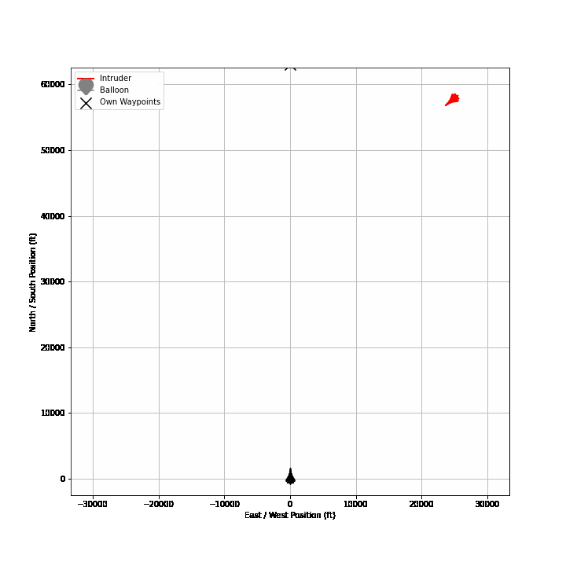

# f16-flight-dynamics


*F16 Simulation Rendered in FlightGear*

|  |                                 |
|--------------------------------------------------|---------------------------------------------------------------------------|
|  |  |

*Example Air Collision Avoidance Scenarios Simulated Using F16 Dynamics Model*


## Overview
This repo contains an efficient implementation of the aircraft model described in Stevens and Lewis 
"Aircraft Control and Simulation",3rd Ed., written in C++. The project produces a shared library `f16_flight_dynamics`
as well as the python module `f16dynamics` that accesses it via python bindings. The python module provides drop-in 
replacement objects / functions for the same models implemented in [AeroBenchVVPython](https://github.com/stanleybak/AeroBenchVVPython) 
and [F16 CSAF](https://pypi.org/project/csaf-controls/).

### Citation
This implementation is based on and tested against the model available in [AeroBenchVVPython](https://github.com/stanleybak/AeroBenchVVPython). 
The model was designed to test autopilot and analysis methods. No claim is made about its accuracy; the F-16 model is 
based on a common aircraft model with additional controllers placed on top of it.

> Heidlauf, P., Collins, A., Bolender, M., & Bak, S. (2018, September). *Verification Challenges in F-16 Ground Collision
> Avoidance and Other Automated Maneuvers.* In ARCH@ ADHS (pp. 208-217).

>Stevens, B. L., Lewis, F. L., & Johnson, E. N. (2015). *Aircraft control and simulation: dynamics, controls design, and 
> autonomous systems.* John Wiley & Sons.

## Benchmarks

Benchmarks were run on the following scenarios
* *GCAS Scenario* - A GCAS autopilot was installed on a single f16 and placed at low altitude. The simulation is run 
for 2 minutes.
* *ACAS Scenario* - An ACAS autopilot, being a NN compressed early prototype of ACAS Xu, was installed on a single f16 
and placed near an intruder f16 heading towards it (2 f16 plants in total). The simulation is run for 2 minutes. 

See [this notebook](./notebooks/CSAF_Integration.ipynb) for more.

|                          | GCAS Scenario | ACAS Scenario    |
|--------------------------|---------------|------------------|
| **F16Dynamics (ours)**   | **0.618 s**   | **1.431 s**      |
| CSAF F16 - numba enabled | 3.990 s       | 4.68 s           |
| CSAF F16                 | 4.933 s       | 10.548 s         |

## Installation

### `f16dynamics` Python Module

#### pip
The C++ library uses Boost and will not build unless it's installed. A simple way to install boost, using common
python tools, is via `conda`
```shell
conda install -c conda-forge boost==1.76
```

Now clone the repository and install the python module
```shell
git clone https://github.com/EthanJamesLew/f16-flight-dynamics.git
cd  f16-flight-dynamics
pip install .
```

Check that you can import it
```shell
python -c "import f16dynamics"
```

### C++ Libraries

Install `Boost` and `Boost NumPy`. Use CMake to build
```shell
mkdir build
cd build
cmake .. -DCMAKE_BUILD_TYPE=Release
make 
sudo make install
```

## Tests

Proper testing is TBD, with the coverage 
* `f16_flight_dynamics` C++ unit tests
* `f16dynamics` python unit tests
* Testing the C++ dynamics against the VVaerobench implementation and CSAF
* Integration testing with VVaerobench and CSAF

## Jupyter Notebooks

Navigate to `notebooks` and launch jupyter via
```shell
jupyter notebook
```
